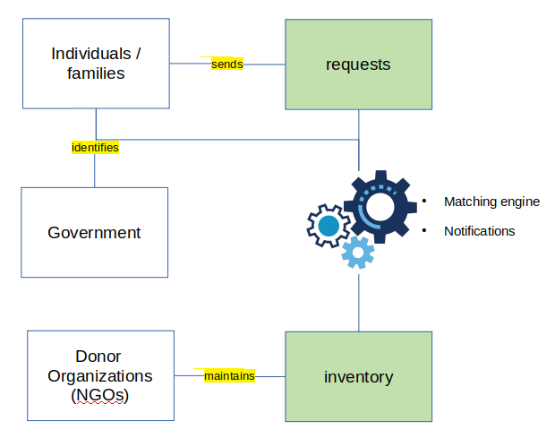

# Empathy
A Donor-to-Request mapping solution for the Call-For-Code Beirut Challenge

## Introduction

On 4 August 2020, tragedy struck the capital of Lebanon, Beirut. A large amount of ammonium nitrate stored at the port of the city of Beirut, the capital of Lebanon, exploded, causing at least 200 deaths, three reported missing, 6,500 injuries, US$10–15 billion in property damage, and leaving an estimated 300,000 people homeless. 

The Unprecedented levels of turmoil in aid. Fortunately, donations are being made, and Non-governmental organizations in partnership with internation organizations are working to take up the responsibility of providing essential support. Support being provided includes the provision of food, mental health services, reconstruction, cash donations and many more. 

A software system ([Al-Wasl-Connect](#)) is being built which aims to integrate data coming from various sources including Foreign Aid Organizations, Government and Local NGOs. This system is still incomplete and our module aims to provide some key features that could help to make it more useful.

### Problem Statement 

The current system works with data which is manually imported into the IBM DB2 Database. This system requires a user to manually maintain a datasheet containing a list of Donor Organizations and their inventory. The database also contains information about requests for aid coming from individuals and families who have been affected by the accident. There are several issues with this system.

* A user has continuously monitor it for new aid requests. These requests may be urgent.

* Donor accounts have no efficient way of identifying requests that they can fulfill while ensuring that they have not already been recieved and fulfilled by other organizations

### Our Solution 

Mapping NGOs with eligible beneficiaries to prompt a quick response by creating a platform that supports real-time notifications to donor organizations, agencies and coordinators. Our solution selects and notifies matching agencies about incoming requests based on the location of the requester and the inventory availability in the Organization to provide the needs of the beneficiaries. 

Our solution is an extension for the existing [Al-Wasl-Connect]() application which matches Requests to NGOs which can fulfill the said requests. 

### Components

1. Notification System

   The notification sends a notification to a matching organization whenever a request is received. This notification is sent via SMS or email. A sample of the notification:

   

2. IBM Watson AI Model for Recommendation System

   The recommendation system selects a matching Donor Organization based on specific criteria:

   * Available inventory: What items are available in the organizations stock?
   * Location of request: Which is the closes donor agency that can fulfill the request?

   This module also contains and Inventory monitoring module that watches for new items in the inventory and updates the recommendation system dataset accordingly

### Progress

Our team is currently working on:

1. The AngularJS component for the Al-Wasl-Connect plugin
2. The Watson model for the Recommendation System

We will be updating the source code repository accordingly.

### Our Team

1. Ikwuo Afia Ikwuo
2. Emmanuel Yusufu
3. Blessing
4. Kuro Souza
5. Ire
6. Samuel
